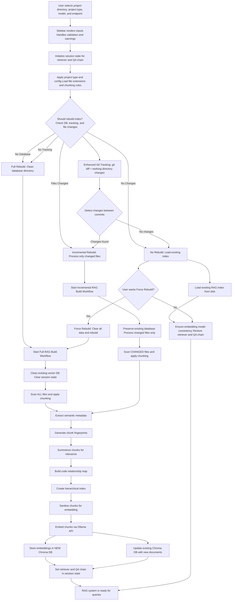
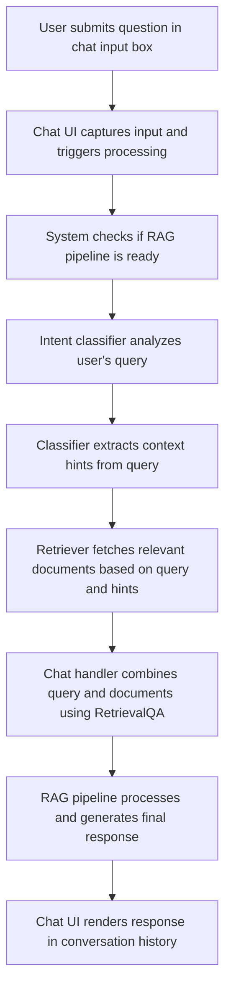
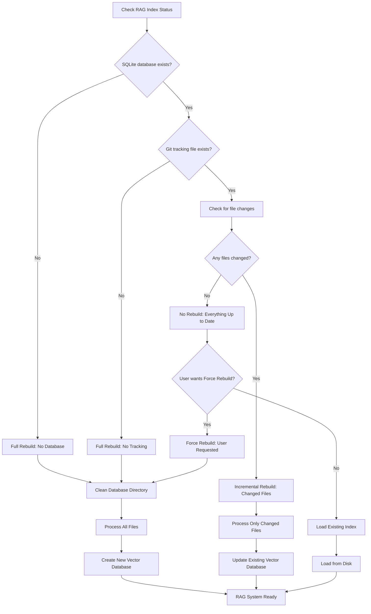
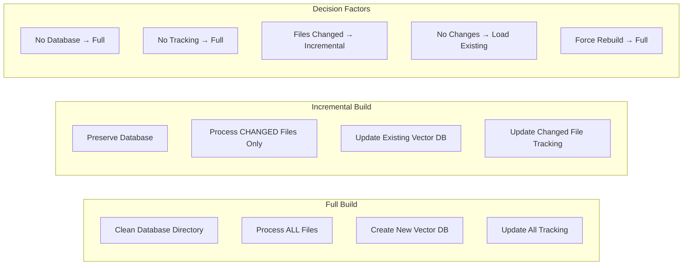

# MERMAID CHART FLOW DIAGRAM

## 🟦 RAG Index Build & Ready Flow

```mermaid
flowchart TD
    A[User selects project directory, project type, model, and endpoint] --> B[Sidebar renders inputs Handles validation and warnings]
    B --> C[Initialize session state for retriever and QA chain]
    C --> D[Apply project type and config Load file extensions and chunking rules]
    D --> E{Should rebuild index? Check DB, tracking, and file changes}
    
    E -->|No Database| F1[Full Rebuild: Clean database directory]
    E -->|No Tracking| F1
    E -->|Files Changed| F2[Incremental Rebuild: Process only changed files]
    E -->|No Changes| F3[No Rebuild: Load existing index]
    
    F1 --> G1[Start Full RAG Build Workflow]
    F2 --> G2[Start Incremental RAG Build Workflow]
    F3 --> S[Load existing RAG index from disk]
    
    G1 --> H1[Clean existing vector DB Clear session state]
    G2 --> H2[Preserve existing database Process changed files only]
    
    H1 --> I[Scan ALL files and apply chunking]
    H2 --> I2[Scan CHANGED files and apply chunking]
    
    I --> J[Extract semantic metadata]
    I2 --> J
    
    J --> K[Generate chunk fingerprints]
    K --> L[Summarize chunks for relevance]
    L --> M[Build code relationship map]
    M --> N[Create hierarchical index]
    N --> O[Sanitize chunks for embedding]
    O --> P[Embed chunks via Ollama API]
    P --> Q1[Store embeddings in NEW Chroma DB]
    P --> Q2[Update existing Chroma DB with new documents]
    
    Q1 --> R[Set retriever and QA chain in session state]
    Q2 --> R
    R --> Z[RAG system is ready for queries]
    
    S --> T[Ensure embedding model consistency Restore retriever and QA chain]
    T --> Z
    
    %% Force Rebuild Flow
    F3 --> U{User wants Force Rebuild?}
    U -->|Yes| V[Force Rebuild: Clear all data and rebuild]
    U -->|No| T
    V --> G1
    
    %% Enhanced Git Tracking
    E --> W[Enhanced Git Tracking: git diff + working directory changes]
    W --> X{Detect changes between commits}
    X -->|Changes found| F2
    X -->|No changes| F3
```

## 🟩 User Query & Answer Flow

```mermaid
flowchart TD
    A[User submits question in chat input box] --> B[Chat UI captures input and triggers processing]
    B --> C[System checks if RAG pipeline is ready]
    C --> D[Intent classifier analyzes user's query]
    D --> E[Classifier extracts context hints from query]
    E --> F[Retriever fetches relevant documents based on query and hints]
    F --> G[Chat handler combines query and documents using RetrievalQA]
    G --> H[RAG pipeline processes and generates final response]
    H --> I[Chat UI renders response in conversation history]
```

## 🟨 Enhanced Decision Flow for Rebuild Logic

```mermaid
flowchart TD
    A[Check RAG Index Status] --> B{SQLite database exists?}
    B -->|No| C[Full Rebuild: No Database]
    B -->|Yes| D{Git tracking file exists?}
    
    D -->|No| E[Full Rebuild: No Tracking]
    D -->|Yes| F[Check for file changes]
    
    F --> G{Any files changed?}
    G -->|Yes| H[Incremental Rebuild: Changed Files]
    G -->|No| I[No Rebuild: Everything Up to Date]
    
    I --> J{User wants Force Rebuild?}
    J -->|Yes| K[Force Rebuild: User Requested]
    J -->|No| L[Load Existing Index]
    
    C --> M[Clean Database Directory]
    E --> M
    K --> M
    
    M --> N[Process All Files]
    H --> O[Process Only Changed Files]
    L --> P[Load from Disk]
    
    N --> Q[Create New Vector Database]
    O --> R[Update Existing Vector Database]
    
    Q --> S[RAG System Ready]
    R --> S
    P --> S
```

## 🟪 Incremental vs Full Build Comparison

```mermaid
flowchart LR
    subgraph "Full Build"
        A1[Clean Database Directory]
        A2[Process ALL Files]
        A3[Create New Vector DB]
        A4[Update All Tracking]
    end
    
    subgraph "Incremental Build"
        B1[Preserve Database]
        B2[Process CHANGED Files Only]
        B3[Update Existing Vector DB]
        B4[Update Changed File Tracking]
    end
    
    subgraph "Decision Factors"
        C1[No Database → Full]
        C2[No Tracking → Full]
        C3[Files Changed → Incremental]
        C4[No Changes → Load Existing]
        C5[Force Rebuild → Full]
    end
```