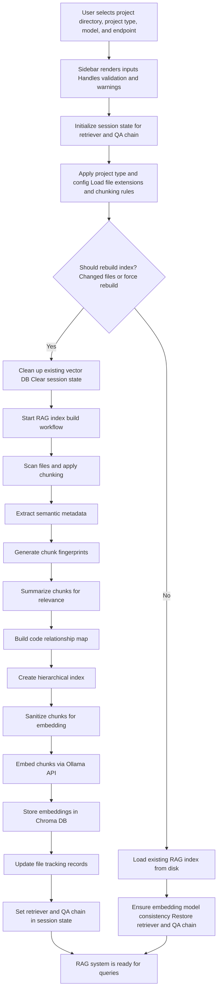
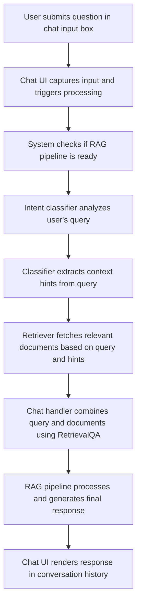

# MERMAILD CHART FLOW DIAGRAM

## 🟦 RAG Index Build & Ready Flow

```mermaid
flowchart TD
    A[User selects project directory, project type, model, and endpoint] --> B[Sidebar renders inputs Handles validation and warnings]
    B --> C[Initialize session state for retriever and QA chain]
    C --> D[Apply project type and config Load file extensions and chunking rules]
    D --> E{Should rebuild index? Changed files or force rebuild}

    E -->|Yes| F[Clean up existing vector DB Clear session state]
    F --> G[Start RAG index build workflow]
    G --> H[Scan files and apply chunking]
    H --> I[Extract semantic metadata]
    I --> J[Generate chunk fingerprints]
    J --> K[Summarize chunks for relevance]
    K --> L[Build code relationship map]
    L --> M[Create hierarchical index]
    M --> N[Sanitize chunks for embedding]
    N --> O[Embed chunks via Ollama API]
    O --> P[Store embeddings in Chroma DB]
    P --> Q[Update file tracking records]
    Q --> R[Set retriever and QA chain in session state]
    R --> Z[RAG system is ready for queries]

    E -->|No| S[Load existing RAG index from disk]
    S --> T[Ensure embedding model consistency Restore retriever and QA chain]
    T --> Z

```

## 🟩 User Query & Answer Flow

```mermaid
flowchart TD
    A[User submits question in chat input box] --> B[Chat UI captures input and triggers processing]
    B --> C[System checks if RAG pipeline is ready]
    C --> D[Intent classifier analyzes user's query]
    D --> E[Classifier extracts context hints from query]
    E --> F[Retriever fetches relevant documents based on query and hints]
    F --> G[Chat handler combines query and documents using RetrievalQA]
    G --> H[RAG pipeline processes and generates final response]
    H --> I[Chat UI renders response in conversation history]


```