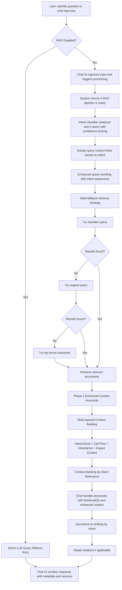
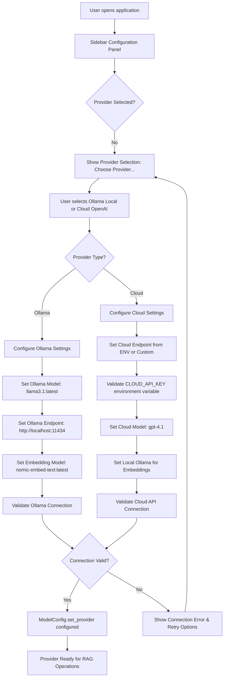
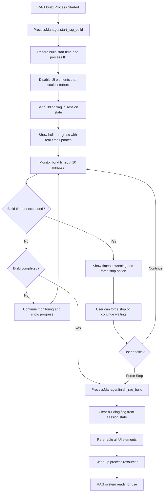
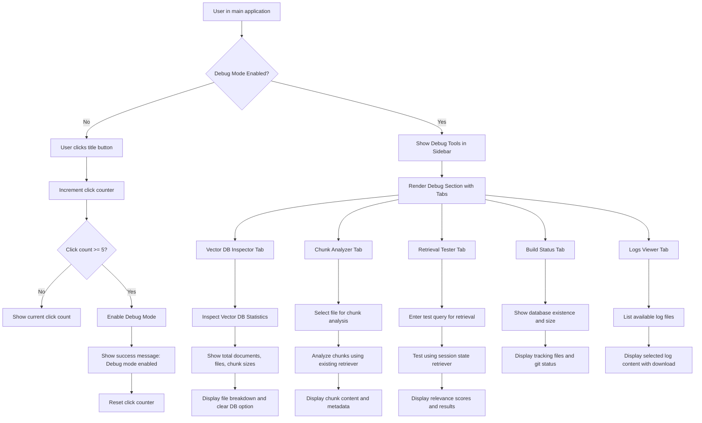
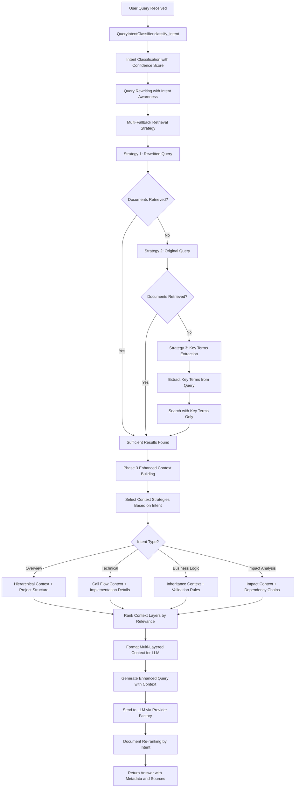

# MERMAID CHART FLOW DIAGRAM

## 🟦 RAG Index Build & Ready Flow

```mermaid
flowchart TD
    A[User selects project directory, project type, and provider] --> A1{Choose Provider}
    A1 -->|Ollama Local| A2[Configure Ollama Model & Endpoint]
    A1 -->|Cloud OpenAI| A3[Configure Cloud Endpoint & API Key]
    A2 --> B[Validate Ollama Connection]  
    A3 --> B1[Validate Cloud API Key & Endpoint]
    B --> C[Initialize session state for retriever and QA chain]
    B1 --> C
    C --> D[Apply project type and config Load file extensions and chunking rules]
    D --> E{Should rebuild index? Check DB, tracking, and file changes}
    
    E -->|No Database| F1[Full Rebuild: Clean database directory]
    E -->|No Tracking| F1
    E -->|Files Changed| F2[Incremental Rebuild: Process only changed files]
    E -->|No Changes| F3[No Rebuild: Load existing index]
    
    F1 --> PM1[ProcessManager.start_rag_build]
    F2 --> PM1
    PM1 --> PM2[Disable UI During Build]
    PM2 --> PM3[Show Build Progress with Timeout Protection]
    
    PM3 --> G1[Start Full RAG Build Workflow]
    F2 --> G2[Start Incremental RAG Build Workflow]
    F3 --> S[Load existing RAG index from disk]
    
    G1 --> H1[Clean existing vector DB Clear session state]
    G2 --> H2[Preserve existing database Process changed files only]
    
    H1 --> I[Scan ALL files and apply chunking]
    H2 --> I2[Scan CHANGED files and apply chunking]
    
    I --> J[Extract semantic metadata]
    I2 --> J
    
    J --> J1[Build Cross-References]
    J1 --> J2[Symbol Definitions & Usage Maps]
    J2 --> J3[Inheritance Relationships] 
    J3 --> J4[Design Pattern Detection]
    J4 --> K[Generate chunk fingerprints]
    K --> L[Summarize chunks for relevance]
    L --> M[Build code relationship map]
    M --> N[Create hierarchical index]
    N --> N1[Phase 3 Enhanced Context Building]
    N1 --> N2[Multi-strategy Context Assembly]
    N2 --> O[Sanitize chunks for embedding]
    O --> P[Embed chunks via Ollama API with Model Consistency]
    P --> Q1[Store embeddings in NEW Chroma DB]
    P --> Q2[Update existing Chroma DB with new documents]
    
    Q1 --> R[Set retriever and QA chain in session state]
    Q2 --> R
    R --> PM4[ProcessManager.finish_rag_build]
    PM4 --> PM5[Re-enable UI Elements]
    PM5 --> Z[RAG system is ready for queries]
    
    S --> T[Ensure embedding model consistency Restore retriever and QA chain]
    T --> Z
    
    %% Force Rebuild Flow
    F3 --> U{User wants Force Rebuild?}
    U -->|Yes| V[Force Rebuild: Clear all data and rebuild]
    U -->|No| T
    V --> G1
    
    %% Enhanced Git Tracking
    E --> W[Enhanced Git Tracking: git diff + working directory changes]
    W --> X{Detect changes between commits}
    X -->|Changes found| F2
    X -->|No changes| F3
    
    %% Debug Mode Activation
    Z --> DM1{Debug Mode Enabled?}
    DM1 -->|5-Click Activation| DM2[Show Debug Tools Panel]
    DM2 --> DM3[Vector DB Inspector, Chunk Analyzer, Retrieval Tester]
```

## 🟩 User Query & Answer Flow

## 🟨 Enhanced Provider Selection Flow

## 🟪 Process Management & UI Protection Flow

## 🟫 Debug Mode Activation & Tools Flow

## 🟦 Cross-Reference Building & Enhanced Context Flow

```mermaid
flowchart TD
    A[Documents with Enhanced Metadata] --> B[CrossReferenceBuilder.build_cross_references]
    B --> C[Extract Symbol Definitions]
    C --> C1[Method signatures with parameters and return types]
    C1 --> C2[Class definitions and interfaces]
    C2 --> C3[Variable and constant definitions]
    
    C3 --> D[Build Usage Maps]
    D --> D1[Function call relationships]
    D1 --> D2[Class instantiation patterns]
    D2 --> D3[Variable usage tracking]
    
    D3 --> E[Build Inheritance Relationships]
    E --> E1[Class hierarchy mapping]
    E1 --> E2[Interface implementation tracking]
    E2 --> E3[Abstract class relationships]
    
    E3 --> F[Detect Design Patterns]
    F --> F1[Factory Pattern Detection]
    F1 --> F2[Singleton Pattern Detection]
    F2 --> F3[Observer Pattern Detection]
    F3 --> F4[Strategy Pattern Detection]
    
    F4 --> G[Generate Statistics]
    G --> G1[Symbol count and distribution]
    G1 --> G2[Usage frequency analysis]
    G2 --> G3[Complexity metrics]
    
    G3 --> H[Save Cross-References to Files]
    H --> H1[cross_references.json - Main data]
    H1 --> H2[call_graph_index.json - Call relationships]
    H2 --> H3[inheritance_index.json - Class hierarchies]
    H3 --> H4[symbol_usage_index.json - Usage patterns]
    
    H4 --> I[Context Builder Loads Cross-Reference Data]
    I --> J[Multi-Strategy Context Assembly Available]
```

## 🟩 Enhanced Query Processing with Fallback Strategies

