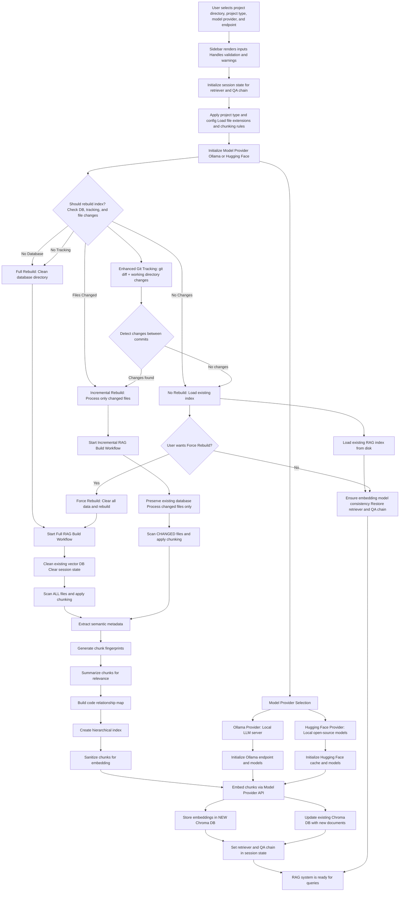
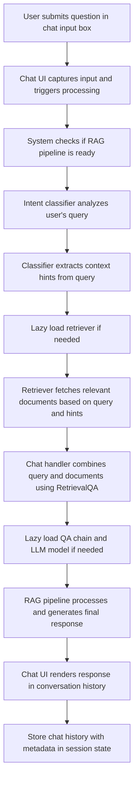
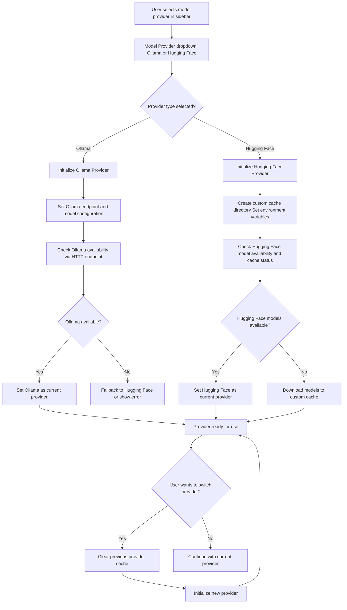
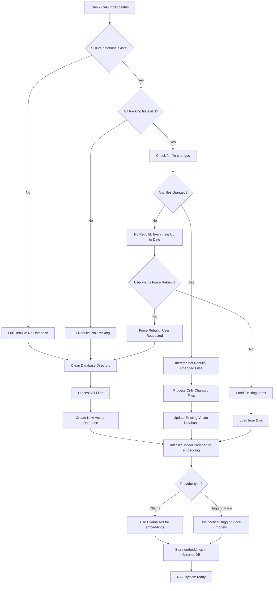
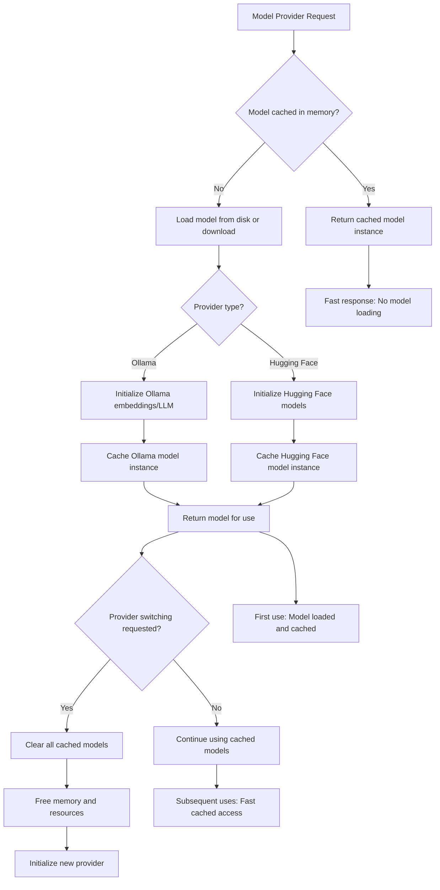

# MERMAID CHART FLOW DIAGRAM

## 🟦 RAG Index Build & Ready Flow

## 🟩 User Query & Answer Flow

## 🟨 Model Provider Management Flow

## 🟪 Enhanced Decision Flow for Rebuild Logic

## 🟦 Model Caching and Performance Flow

## 🔄 Key System Improvements

### **Multi-Provider Architecture**
- **Abstract Interface**: ModelProvider ABC for consistent provider interface
- **Provider Implementations**: OllamaProvider and HuggingFaceProvider
- **Factory Pattern**: ModelProviderFactory for creating provider instances
- **Global Management**: Centralized provider switching and management

### **Model Caching System**
- **In-Memory Caching**: Prevents model reloading on every access
- **Lazy Loading**: Models loaded only when actually needed
- **Cache Management**: Automatic cache clearing during provider switching
- **Custom Cache Directory**: Dedicated Hugging Face cache location

### **Enhanced RAG Management**
- **Lazy Loading**: Retriever and QA chain loaded only when needed
- **Incremental Builds**: Smart rebuild detection and processing
- **Git Tracking**: Enhanced change detection with commit differences
- **User Experience**: Clear progress indicators and confirmation flows

### **Performance Optimizations**
- **Model Caching**: Prevents "Loading checkpoint shards" messages
- **Lazy Initialization**: Components initialized only when needed
- **Memory Management**: Automatic cache clearing to prevent memory issues
- **Provider Switching**: Seamless switching without conflicts

This enhanced Mermaid chart flow provides a comprehensive visual representation of the new multi-provider system, model caching, and incremental build capabilities while maintaining backward compatibility with existing Ollama functionality.