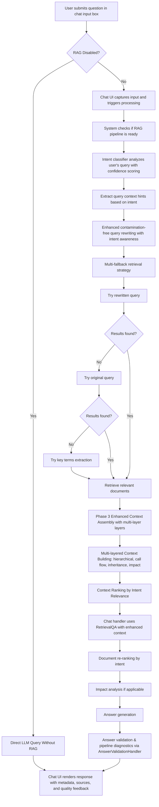
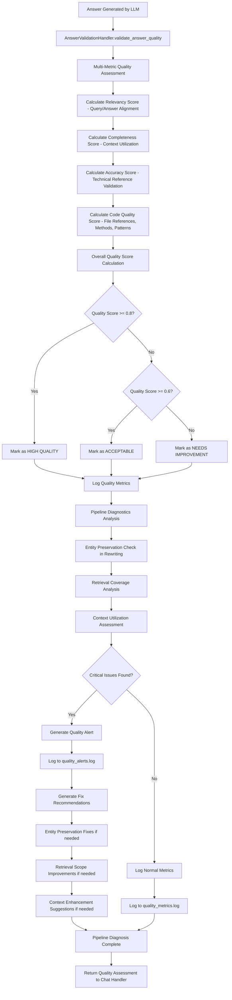

# MERMAID CHART FLOW DIAGRAM - UPDATED FOR 2025-09-03 ENHANCEMENTS

## 🟦 RAG Index Build & Ready Flow (Enhanced)

```mermaid
flowchart TD
    A[User selects project directory, project type, and provider] --> A1{Choose Provider}
    A1 -->|Ollama Local| A2[Configure Ollama Model & Endpoint]
    A1 -->|Cloud OpenAI| A3[Configure Cloud Endpoint & API Key]
    A2 --> B[Validate Ollama Connection]  
    A3 --> B1[Validate Cloud API Key & Endpoint]
    B --> C[Initialize session state for retriever and QA chain]
    B1 --> C
    C --> D[Apply project type and config Load file extensions and chunking rules]
    D --> E{Should rebuild index? Check DB, tracking, and file changes}
    
    E -->|No Database| F1[Full Rebuild: Clean database directory]
    E -->|No Tracking| F1
    E -->|Files Changed| F2[Incremental Rebuild: Process only changed files]
    E -->|No Changes| F3[No Rebuild: Load existing index]
    
    F1 --> PM1[ProcessManager.start_rag_build]
    F2 --> PM1
    PM1 --> PM2[Disable UI During Build]
    PM2 --> PM3[Show Build Progress with Timeout Protection]
    
    PM3 --> G1[Start Full RAG Build Workflow]
    F2 --> G2[Start Incremental RAG Build Workflow]
    F3 --> S[Load existing RAG index from disk]
    
    G1 --> H1[Clean existing vector DB and clear session state]
    G2 --> H2[Preserve existing database and process changed files]
    
    H1 --> I[Scan ALL files and apply semantic chunking]
    H2 --> I2[Scan CHANGED files and apply semantic chunking]
    
    I --> J[Extract semantic metadata including design patterns, call sites, error handling]
    I2 --> J
    
    J --> J1[Build Cross-References: symbols, call graphs, inheritance]
    J1 --> J2[Generate statistics and fingerprint chunks]
    J2 --> J3[Summarize chunks for relevance]
    J3 --> J4[Build code relationships and hierarchical index]
    J4 --> N1[Phase 3 Enhanced Context Building]
    N1 --> N2[Multi-strategy Context Assembly incorporating impact analysis]
    N2 --> O[Sanitize chunks for embedding]
    O --> P[Embed chunks via Ollama API with Model Consistency]
    P --> Q1[Store embeddings in NEW Chroma DB]
    P --> Q2[Update existing Chroma DB with new documents]
    
    Q1 --> R[Set retriever and QA chain in session state]
    Q2 --> R
    R --> PM4[ProcessManager.finish_rag_build]
    PM4 --> PM5[Re-enable UI Elements]
    PM5 --> Z[RAG system is ready for queries]
    
    S --> T[Ensure embedding model consistency and restore retriever/QA chain]
    T --> Z
    
    %% Force Rebuild Flow
    F3 --> U{User wants Force Rebuild?}
    U -->|Yes| V[Force Rebuild: Clear all data and rebuild]
    U -->|No| T
    V --> G1
    
    %% Enhanced Git Tracking
    E --> W[Enhanced Git Tracking: full git diff + working directory]
    W --> X{Detect changes between commits}
    X -->|Changes found| F2
    X -->|No changes| F3
    
    %% Debug Mode Activation
    Z --> DM1{Debug Mode Enabled?}
    DM1 -->|5-Click Activation| DM2[Show Debug Tools Panel]
    DM2 --> DM3[Vector DB Inspector, Chunk Analyzer, Retrieval Tester]
```

## 🟩 User Query & Answer Flow (Enhanced with Validation & Diagnostics)

## 🟨 Enhanced Provider Selection Flow

## 🟪 Process Management & UI Protection Flow

## 🟫 Debug Mode Activation & Tools Flow

## 🟦 Cross-Reference Building & Enhanced Context Flow (Updated)

## 🟩 Enhanced Query Processing with Fallback Strategies (Updated)

## 🆕 **New Addition: Answer Validation & Quality Monitoring Flow (2025-09-03)**

## **Key Enhancements Reflected in Updated Charts:**

### **🔄 Updated Existing Flows:**
1. **RAG Build Flow**: Now includes enhanced metadata extraction with design patterns, call sites, and error handling
2. **Query Processing**: Added contamination-free query rewriting and multi-fallback retrieval strategies  
3. **Answer Generation**: Integrated answer validation and pipeline diagnostics via `AnswerValidationHandler`

### **🆕 New Components Added:**
1. **Answer Validation Handler**: Complete quality assessment pipeline with multi-metric scoring
2. **Retrieval Logic Module**: Modular retrieval operations with intelligent fallback mechanisms
3. **Quality Monitoring**: Real-time quality alerts and pipeline diagnostics
4. **Enhanced Logging**: New log files for quality metrics, alerts, and pipeline diagnosis

### **🐛 Bug Fixes Represented:**
1. **Entity Preservation**: Query rewriting now maintains important technical terms
2. **Retrieval Coverage**: Multi-strategy approach ensures comprehensive document retrieval
3. **Quality Consistency**: Continuous validation and monitoring prevents poor responses
4. **Modular Architecture**: Clean separation of concerns for better maintainability

These updated Mermaid charts provide a complete and accurate representation of the enhanced RAG Codebase QA Tool, including all recent improvements and architectural changes made on 2025-09-03.

Sources
[1] MERMAID_CHART.md https://ppl-ai-file-upload.s3.amazonaws.com/web/direct-files/attachments/82676895/c04e8dda-2d1d-46a5-857b-421f61c92f78/MERMAID_CHART.md
