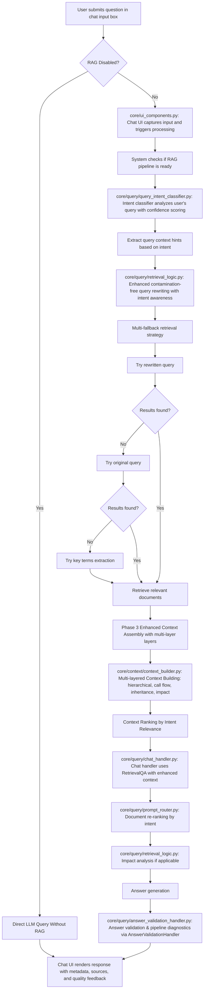
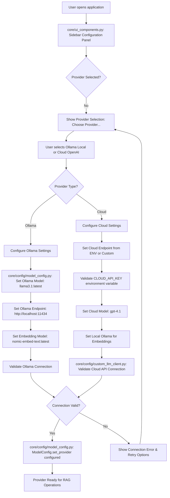
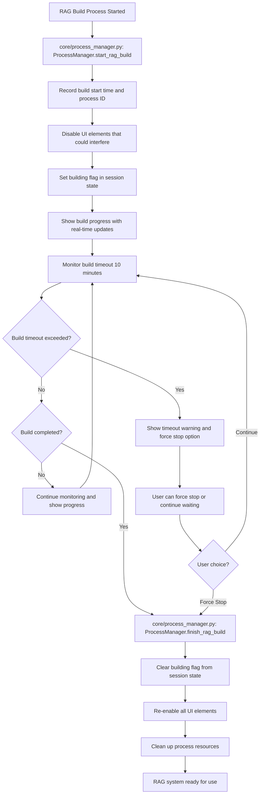
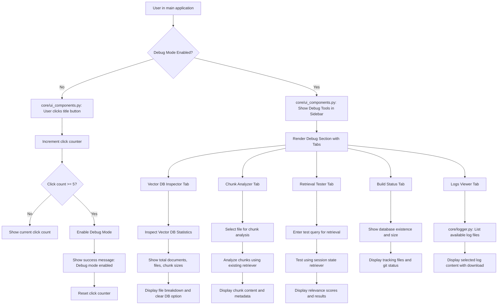
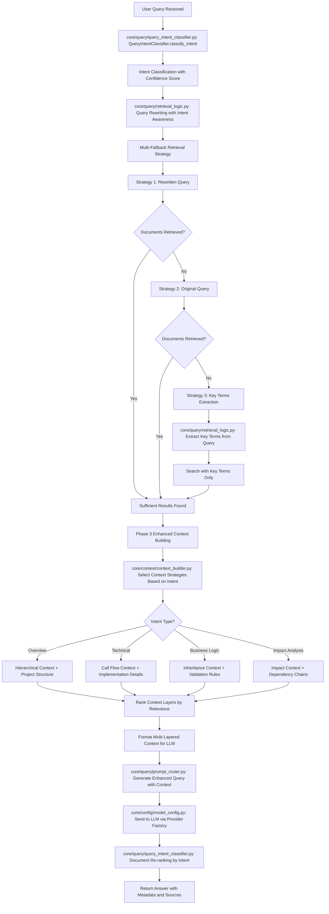
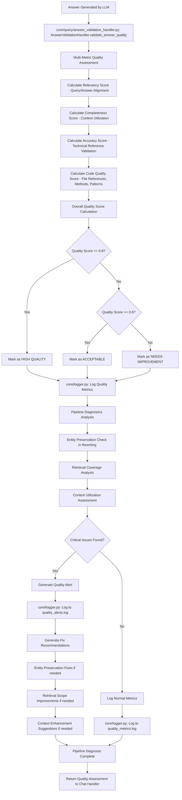
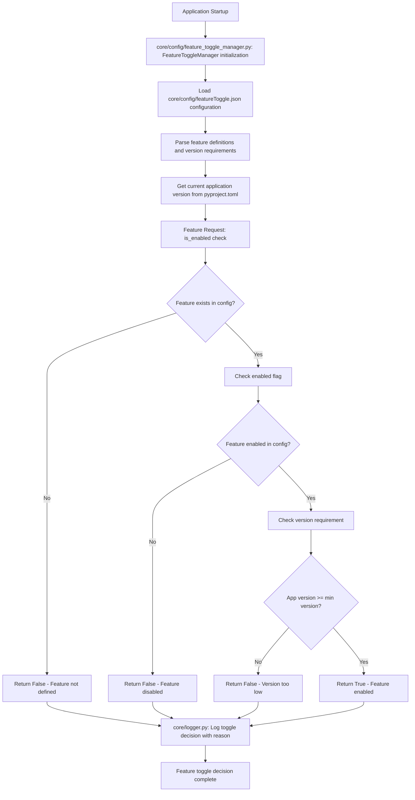

# MERMAID CHART FLOW DIAGRAM - UPDATED FOR 2025-09-03 ENHANCEMENTS

## 🟦 RAG Index Build & Ready Flow (Enhanced)

```mermaid
flowchart TD
    A[User selects project directory, project type, and provider] --> A1{Choose Provider}
    A1 -->|Ollama Local| A2[Configure Ollama Model & Endpoint]
    A1 -->|Cloud OpenAI| A3[Configure Cloud Endpoint & API Key]
    A2 --> B[Validate Ollama Connection]  
    A3 --> B1[Validate Cloud API Key & Endpoint]
    B --> C[Initialize session state for retriever and QA chain]
    B1 --> C
    C --> D[Apply project type and config Load file extensions and chunking rules]
    D --> E{Should rebuild index? Check DB, tracking, and file changes}
    
    E -->|No Database| F1[Full Rebuild: Clean database directory]
    E -->|No Tracking| F1
    E -->|Files Changed| F2[Incremental Rebuild: Process only changed files]
    E -->|No Changes| F3[No Rebuild: Load existing index]
    
    F1 --> PM1[core/process_manager.py: ProcessManager.start_rag_build]
    F2 --> PM1
    PM1 --> PM2[Disable UI During Build]
    PM2 --> PM3[Show Build Progress with Timeout Protection]
    
    PM3 --> G1[Start Full RAG Build Workflow]
    F2 --> G2[Start Incremental RAG Build Workflow]
    F3 --> S[Load existing RAG index from disk]
    
    G1 --> H1[Clean existing vector DB and clear session state]
    G2 --> H2[Preserve existing database and process changed files]
    
    H1 --> I[core/index_builder.py: Scan ALL files and apply semantic chunking]
    H2 --> I2[core/index_builder.py: Scan CHANGED files and apply semantic chunking]
    
    I --> J[core/context/metadata_extractor.py: Extract semantic metadata including design patterns, call sites, error handling]
    I2 --> J
    
    J --> J1[core/context/cross_reference_builder.py: Build Cross-References: symbols, call graphs, inheritance]
    J1 --> J2[Generate statistics and fingerprint chunks]
    J2 --> J3[core/context/chunker_factory.py: Summarize chunks for relevance]
    J3 --> J4[core/context/hierarchical_indexer.py: Build code relationships and hierarchical index]
    J4 --> N1[Phase 3 Enhanced Context Building]
    N1 --> N2[core/context/context_builder.py: Multi-strategy Context Assembly incorporating impact analysis]
    N2 --> O[Sanitize chunks for embedding]
    O --> P[Embed chunks via Ollama API with Model Consistency]
    P --> Q1[Store embeddings in NEW Chroma DB]
    P --> Q2[Update existing Chroma DB with new documents]
    
    Q1 --> R[Set retriever and QA chain in session state]
    Q2 --> R
    R --> PM4[core/process_manager.py: ProcessManager.finish_rag_build]
    PM4 --> PM5[Re-enable UI Elements]
    PM5 --> Z[RAG system is ready for queries]
    
    S --> T[Ensure embedding model consistency and restore retriever/QA chain]
    T --> Z
    
    %% Force Rebuild Flow
    F3 --> U{User wants Force Rebuild?}
    U -->|Yes| V[Force Rebuild: Clear all data and rebuild]
    U -->|No| T
    V --> G1
    
    %% Enhanced Git Tracking
    E --> W[core/context/git_hash_tracker.py: Enhanced Git Tracking: full git diff + working directory]
    W --> X{Detect changes between commits}
    X -->|Changes found| F2
    X -->|No changes| F3
    
    %% Debug Mode Activation
    Z --> DM1{Debug Mode Enabled?}
    DM1 -->|5-Click Activation| DM2[Show Debug Tools Panel]
    DM2 --> DM3[Vector DB Inspector, Chunk Analyzer, Retrieval Tester]
```

## 🟩 User Query & Answer Flow (Enhanced with Validation & Diagnostics)

## 🟨 Enhanced Provider Selection Flow

## 🟪 Process Management & UI Protection Flow

## 🟫 Debug Mode Activation & Tools Flow

## 🟦 Cross-Reference Building & Enhanced Context Flow (Updated)

```mermaid
flowchart TD
    A[Documents with Enhanced Metadata] --> B[core/context/cross_reference_builder.py: CrossReferenceBuilder.build_cross_references]
    B --> C[Extract Symbol Definitions]
    C --> C1[core/context/metadata_extractor.py: Method signatures with parameters and return types]
    C1 --> C2[Class definitions and interfaces]
    C2 --> C3[Variable and constant definitions]
    
    C3 --> D[Build Usage Maps]
    D --> D1[Function call relationships]
    D1 --> D2[Class instantiation patterns]
    D2 --> D3[Variable usage tracking]
    
    D3 --> E[Build Inheritance Relationships]
    E --> E1[Class hierarchy mapping]
    E1 --> E2[Interface implementation tracking]
    E2 --> E3[Abstract class relationships]
    
    E3 --> F[Detect Design Patterns]
    F --> F1[Factory Pattern Detection]
    F1 --> F2[Singleton Pattern Detection]
    F2 --> F3[Observer Pattern Detection]
    F3 --> F4[Strategy Pattern Detection]
    
    F4 --> G[Generate Statistics]
    G --> G1[Symbol count and distribution]
    G1 --> G2[Usage frequency analysis]
    G2 --> G3[Complexity metrics]
    
    G3 --> H[Save Cross-References to Files]
    H --> H1[cross_references.json - Main data]
    H1 --> H2[call_graph_index.json - Call relationships]
    H2 --> H3[inheritance_index.json - Class hierarchies]
    H3 --> H4[symbol_usage_index.json - Usage patterns]
    
    H4 --> I[core/context/context_builder.py: Context Builder Loads Cross-Reference Data]
    I --> J[core/context/cross_reference_query.py: Multi-Strategy Context Assembly Available]
```

## 🟩 Enhanced Query Processing with Fallback Strategies (Updated)

## 🆕 **New Addition: Answer Validation & Quality Monitoring Flow (2025-09-03)**

## 🟨 Feature Toggle Management Flow (Updated)

## **Key Enhancements Reflected in Updated Charts:**

### **🔄 Updated File Paths:**
1. **Context Processing**: All context-related files now in `core/context/` folder
2. **Query Processing**: All query-related files now in `core/query/` folder
3. **Configuration**: All config files now in `core/config/` folder
4. **Renamed Files**: `build_rag.py` → `core/index_builder.py`

### **🆕 New Components Added:**
1. **core/config/custom_llm_client.py**: Cloud provider LLM client with system/user prompt support
2. **core/context/cross_reference_builder.py**: Cross-reference mapping and call graph generation
3. **core/context/cross_reference_query.py**: Fast cross-reference querying interface
4. **core/query/answer_validation_handler.py**: Complete quality assessment pipeline
5. **core/query/retrieval_logic.py**: Modular retrieval operations with intelligent fallbacks
6. **core/query/prompt_router.py**: Intent-specific prompt templates

### **🏗️ Architectural Improvements:**
1. **Modular Organization**: Clean separation of concerns across specialized folders
2. **Enhanced Maintainability**: Easier navigation and component isolation
3. **Clear Dependencies**: Well-defined interfaces between modules
4. **Scalable Structure**: Easy to add new features and components

### **🔧 Enhanced Features:**
1. **Quality Monitoring**: Real-time validation and pipeline diagnostics
2. **Multi-Provider Support**: Seamless switching between Ollama and cloud providers
3. **Advanced Context Assembly**: Multi-layered context building with cross-references
4. **Feature Toggle System**: Runtime control over advanced capabilities

These updated Mermaid charts now accurately reflect the refactored file structure and enhanced capabilities of the RAG Codebase QA Tool, maintaining all functionality while improving organization and maintainability.

Sources
[1] MERMAID_CHART.md https://ppl-ai-file-upload.s3.amazonaws.com/web/direct-files/attachments/82676895/00d9aa19-2970-4026-9618-689627857795/MERMAID_CHART.md
