# 🎨 Enhanced MERMAID Chart Flow Diagrams - Updated for 2025-09-03 with Visual Improvements

## 🎨 Color Coding System

- **🟣 Purple**: User Actions & Interactions
- **🟢 Teal**: System Processes & Operations  
- **🟠 Orange**: Decision Points & Conditionals
- **🔵 Blue**: Database & Storage Operations
- **🔴 Red**: Warnings, Errors & Critical Actions
- **🟡 Yellow**: Debug & Development Features

## 🟦 RAG Index Build & Ready Flow (Enhanced with Colors & Layout)

```mermaid
flowchart TD
    %% Color Definitions
    classDef userAction fill:#6f42c1,stroke:#4e2a8e,color:#fff,stroke-width:2px,font-weight:bold
    classDef systemProcess fill:#20b2aa,stroke:#008b8b,color:#fff,stroke-width:2px
    classDef decision fill:#ffa500,stroke:#cc8400,color:#000,stroke-width:3px,font-weight:bold
    classDef database fill:#4682b4,stroke:#2c5282,color:#fff,stroke-width:2px
    classDef warning fill:#dc3545,stroke:#a52722,color:#fff,stroke-width:2px,font-weight:bold
    classDef debug fill:#ffd700,stroke:#b8860b,color:#000,stroke-width:2px

    %% User Initialization
    A["👤 User selects project directory,<br/>project type, and provider"]:::userAction
    
    %% Provider Selection Flow
    A --> B{"🔌 Choose Provider?"}:::decision
    B -->|"🏠 Ollama Local"| C["⚙️ Configure Ollama<br/>Model & Endpoint"]:::systemProcess
    B -->|"☁️ Cloud OpenAI"| D["🌐 Configure Cloud<br/>Endpoint & API Key"]:::systemProcess
    
    C --> E["✅ Validate Ollama<br/>Connection"]:::systemProcess
    D --> F["✅ Validate Cloud<br/>Connection"]:::systemProcess
    
    E --> G["🚀 Initialize Session<br/>and State"]:::systemProcess
    F --> G
    
    %% Configuration Loading
    G --> H["📂 Load Project Type<br/>and Config"]:::systemProcess
    H --> I{"🔍 Should Rebuild Index?<br/>(DB/Tracking/Changes)"}:::decision
    
    %% Build Decision Paths
    I -->|"❌ No Database"| J["🗑️ Full Rebuild:<br/>Clean Database"]:::warning
    I -->|"📝 Changes Detected"| K["🔄 Incremental Rebuild:<br/>Process Changed Files"]:::systemProcess
    I -->|"✅ No Changes"| L["💾 Load Existing<br/>Index"]:::database
    
    %% Process Management
    J --> M["🚧 ProcessManager:<br/>start_rag_build()"]:::systemProcess
    K --> M
    M --> N["🚫 Disable UI Controls<br/>During Build"]:::systemProcess
    N --> O["📊 Show Build Progress<br/>with Timeout Protection"]:::systemProcess
    
    %% Build Workflows
    O --> P{"🛠️ Build Workflow Type"}:::decision
    P -->|"🔨 Full Build"| Q["📁 Scan ALL Files<br/>Semantic Chunking"]:::systemProcess
    P -->|"⚡ Incremental"| R["📄 Scan CHANGED Files<br/>Semantic Chunking"]:::systemProcess
    
    %% Core Processing Pipeline
    Q --> S["🧠 core/context/metadata_extractor.py:<br/>Extract Metadata & Patterns"]:::systemProcess
    R --> S
    S --> T["🔗 core/context/cross_reference_builder.py:<br/>Build Cross-References"]:::systemProcess
    T --> U["📊 Generate Statistics<br/>& Fingerprints"]:::systemProcess
    U --> V["📝 core/context/chunker_factory.py:<br/>Summarize Chunks"]:::systemProcess
    V --> W["🏗️ core/context/hierarchical_indexer.py:<br/>Build Hierarchical Index"]:::systemProcess
    W --> X["🎯 Enhanced Context<br/>Assembly"]:::systemProcess
    X --> Y["🔢 Embed Chunks via<br/>Provider API"]:::systemProcess
    
    %% Database Operations
    Y --> Z["💾 Save to Vector<br/>Database"]:::database
    Z --> AA["🔧 Setup Retriever<br/>& QA Chain"]:::systemProcess
    AA --> BB["🚧 ProcessManager:<br/>finish_rag_build()"]:::systemProcess
    BB --> CC["✅ Re-enable UI<br/>Controls"]:::systemProcess
    CC --> DD["🎉 System Ready<br/>for Queries"]:::userAction
    
    %% Existing Index Path
    L --> EE["🔍 Verify Model<br/>Consistency"]:::systemProcess
    EE --> AA
    
    %% Error Handling
    O --> FF{"⏰ Timeout Exceeded?<br/>(15 min limit)"}:::decision
    FF -->|"⚠️ Yes"| GG["🚨 Show Timeout Warning<br/>& Force Stop Option"]:::warning
    FF -->|"✅ No"| O
    GG --> HH{"👤 User Action"}:::decision
    HH -->|"🛑 Force Stop"| II["❌ Force Stop Build"]:::warning
    HH -->|"⏳ Continue"| O
    II --> CC
    
    %% Debug Mode
    DD --> JJ{"🔧 Debug Mode<br/>Enabled?"}:::decision
    JJ -->|"🎯 5-Click Activation"| KK["🛠️ Show Debug Tools<br/>Panel"]:::debug
    KK --> LL["🔍 Vector DB Inspector<br/>Chunk Analyzer<br/>Retrieval Tester"]:::debug
```

## 🟩 User Query & Answer Flow (Enhanced with Advanced Validation)

```mermaid
flowchart TD
    %% Color Definitions
    classDef userInput fill:#6f42c1,stroke:#4e2a8e,color:#fff,stroke-width:2px,font-weight:bold
    classDef process fill:#20b2aa,stroke:#008b8b,color:#fff,stroke-width:2px
    classDef decision fill:#ffa500,stroke:#cc8400,color:#000,stroke-width:3px,font-weight:bold
    classDef validation fill:#28a745,stroke:#1e7e34,color:#fff,stroke-width:2px
    classDef fallback fill:#17a2b8,stroke:#117a8b,color:#fff,stroke-width:2px

    %% User Input
    A["💬 User submits question<br/>in chat input box"]:::userInput
    
    %% RAG Toggle Check
    A --> B{"🔘 RAG Disabled?"}:::decision
    B -->|"❌ Yes"| C["🤖 Direct LLM Query<br/>Without RAG"]:::process
    B -->|"✅ No"| D["🎯 core/ui_components.py:<br/>Chat UI captures input"]:::process
    
    C --> E["💬 Chat UI renders<br/>response"]:::process
    
    %% Core Processing Pipeline
    D --> F["✅ System checks if<br/>RAG pipeline ready"]:::process
    F --> G["🎯 core/query/query_intent_classifier.py:<br/>Intent Analysis & Confidence"]:::process
    G --> H["📝 Extract query context<br/>hints based on intent"]:::process
    H --> I["🔄 core/query/retrieval_logic.py:<br/>Contamination-free Query Rewriting"]:::process
    
    %% Multi-Strategy Retrieval
    I --> J["🎯 Multi-fallback<br/>Retrieval Strategy"]:::process
    J --> K["🔍 Strategy 1:<br/>Try Rewritten Query"]:::process
    K --> L{"📊 Results Found?"}:::decision
    
    L -->|"❌ No"| M["🔄 Strategy 2:<br/>Try Original Query"]:::fallback
    L -->|"✅ Yes"| N["📄 Retrieve Relevant<br/>Documents"]:::process
    
    M --> O{"📊 Results Found?"}:::decision
    O -->|"❌ No"| P["🔑 Strategy 3:<br/>Key Terms Extraction"]:::fallback
    O -->|"✅ Yes"| N
    P --> N
    
    %% Context Assembly
    N --> Q["🏗️ Phase 3: Enhanced Context<br/>Assembly with Multi-layers"]:::process
    Q --> R["🎯 core/context/context_builder.py:<br/>Multi-layered Context Building"]:::process
    R --> S["📊 Context Ranking<br/>by Intent Relevance"]:::process
    S --> T["🤖 core/query/chat_handler.py:<br/>RetrievalQA with Enhanced Context"]:::process
    
    %% Final Processing
    T --> U["📋 core/query/prompt_router.py:<br/>Document Re-ranking by Intent"]:::process
    U --> V["🎯 core/query/retrieval_logic.py:<br/>Impact Analysis if Applicable"]:::process
    V --> W["✨ Answer Generation"]:::process
    W --> X["✅ core/query/answer_validation_handler.py:<br/>Answer Validation & Diagnostics"]:::validation
    X --> E
    
    %% Feedback Loop
    E --> Y["📝 Prompt User<br/>for Feedback"]:::userInput
```

## 🟨 Enhanced Provider Selection Flow (Detailed Configuration)

```mermaid
flowchart TD
    %% Color Definitions
    classDef user fill:#6f42c1,stroke:#4e2a8e,color:#fff,stroke-width:2px,font-weight:bold
    classDef system fill:#20b2aa,stroke:#008b8b,color:#fff,stroke-width:2px
    classDef decision fill:#ffa500,stroke:#cc8400,color:#000,stroke-width:3px,font-weight:bold
    classDef error fill:#dc3545,stroke:#a52722,color:#fff,stroke-width:2px,font-weight:bold
    classDef success fill:#28a745,stroke:#1e7e34,color:#fff,stroke-width:2px

    %% Application Start
    A["🚀 User Opens<br/>Application"]:::user
    A --> B["🎛️ core/ui_components.py:<br/>Sidebar Configuration Panel"]:::system
    B --> C{"🔌 Provider Selected?"}:::decision
    
    %% Provider Selection
    C -->|"❌ No"| D["❓ Show Provider Selection:<br/>Choose Provider..."]:::user
    C -->|"✅ Yes"| E["✅ Proceed with<br/>Configuration"]:::system
    
    D --> F["👤 User selects Ollama Local<br/>or Cloud OpenAI"]:::user
    F --> G{"🤔 Provider Type?"}:::decision
    
    %% Ollama Configuration
    G -->|"🏠 Ollama"| H["⚙️ Configure Ollama<br/>Settings"]:::system
    H --> I["🧠 core/config/model_config.py:<br/>Set Model: llama3.1:latest"]:::system
    I --> J["🔗 Set Endpoint:<br/>http://localhost:11434"]:::system
    J --> K["📊 Set Embedding Model:<br/>nomic-embed-text:latest"]:::system
    K --> L["✅ Validate Ollama<br/>Connection"]:::system
    
    %% Cloud Configuration  
    G -->|"☁️ Cloud"| M["🌐 Configure Cloud<br/>Settings"]:::system
    M --> N["🔗 Set Cloud Endpoint<br/>from ENV or Custom"]:::system
    N --> O["🔑 Validate CLOUD_API_KEY<br/>environment variable"]:::system
    O --> P["🤖 Set Cloud Model:<br/>gpt-4.1"]:::system
    P --> Q["🏠 Set Local Ollama<br/>for Embeddings"]:::system
    Q --> R["✅ core/config/custom_llm_client.py:<br/>Validate Cloud API Connection"]:::system
    
    %% Validation Results
    L --> S{"🔍 Connection Valid?"}:::decision
    R --> S
    S -->|"✅ Yes"| T["⚙️ core/config/model_config.py:<br/>ModelConfig.set_provider()"]:::success
    S -->|"❌ No"| U["🚨 Show Connection Error<br/>& Retry Options"]:::error
    U --> D
    T --> V["🎉 Provider Ready<br/>for RAG Operations"]:::success
```

## 🟪 Process Management & UI Protection Flow (Enhanced Safety)

```mermaid
flowchart TD
    %% Color Definitions
    classDef process fill:#20b2aa,stroke:#008b8b,color:#fff,stroke-width:2px
    classDef decision fill:#ffa500,stroke:#cc8400,color:#000,stroke-width:3px,font-weight:bold
    classDef error fill:#dc3545,stroke:#a52722,color:#fff,stroke-width:2px,font-weight:bold
    classDef success fill:#28a745,stroke:#1e7e34,color:#fff,stroke-width:2px

    %% Process Start
    A["🚧 RAG Build Process<br/>Started"]:::process
    A --> B["📝 core/process_manager.py:<br/>ProcessManager.start_rag_build()"]:::process
    B --> C["⏰ Record build start time<br/>and process ID"]:::process
    C --> D["🚫 Disable UI elements that<br/>could interfere"]:::process
    D --> E["🏷️ Set building flag<br/>in session state"]:::process
    E --> F["📊 Show build progress<br/>with real-time updates"]:::process
    
    %% Monitoring Loop
    F --> G["⏰ Monitor build timeout<br/>(15 minute limit)"]:::process
    G --> H{"🚨 Build timeout<br/>exceeded?"}:::decision
    H -->|"✅ No"| I{"✅ Build completed?"}:::decision
    H -->|"⚠️ Yes"| J["🚨 Show timeout warning<br/>and force stop option"]:::error
    
    %% Completion Path
    I -->|"❌ No"| K["📈 Continue monitoring<br/>and show progress"]:::process
    I -->|"✅ Yes"| L["🏁 core/process_manager.py:<br/>ProcessManager.finish_rag_build()"]:::success
    K --> G
    
    %% Error Handling
    J --> M["👤 User can force stop<br/>or continue waiting"]:::process
    M --> N{"🤔 User choice?"}:::decision
    N -->|"🛑 Force Stop"| L
    N -->|"⏳ Continue"| G
    
    %% Cleanup
    L --> O["🗑️ Clear building flag<br/>from session state"]:::process
    O --> P["✅ Re-enable all<br/>UI elements"]:::process
    P --> Q["🧹 Clean up process<br/>resources"]:::process
    Q --> R["🎉 RAG system ready<br/>for use"]:::success
```

## 🟫 Debug Mode Activation & Tools Flow (Enhanced Developer Experience)

```mermaid
flowchart TD
    %% Color Definitions
    classDef user fill:#6f42c1,stroke:#4e2a8e,color:#fff,stroke-width:2px,font-weight:bold
    classDef system fill:#20b2aa,stroke:#008b8b,color:#fff,stroke-width:2px
    classDef debug fill:#ffd700,stroke:#b8860b,color:#000,stroke-width:2px,font-weight:bold
    classDef decision fill:#ffa500,stroke:#cc8400,color:#000,stroke-width:3px,font-weight:bold

    %% Debug Activation
    A["👤 User in main<br/>application"]:::user
    A --> B{"🔧 Debug Mode<br/>Enabled?"}:::decision
    B -->|"❌ No"| C["🖱️ core/ui_components.py:<br/>User clicks title button"]:::user
    B -->|"✅ Yes"| D["🛠️ Show Debug Tools<br/>in Sidebar"]:::debug
    
    %% Click Counter
    C --> E["🔢 Increment click<br/>counter"]:::system
    E --> F{"🎯 Click count >= 5?"}:::decision
    F -->|"❌ No"| G["📊 Show current<br/>click count"]:::system
    F -->|"✅ Yes"| H["🎉 Enable Debug Mode"]:::debug
    
    G --> I["⏳ Wait for more<br/>clicks"]:::system
    I --> C
    
    H --> J["✅ Show success message:<br/>Debug mode enabled"]:::debug
    J --> K["🔄 Reset click<br/>counter"]:::system
    K --> D
    
    %% Debug Tools Display
    D --> L["🎛️ Render Debug Section<br/>with Tabs"]:::debug
    L --> M["📊 Vector DB<br/>Inspector Tab"]:::debug
    L --> N["🔍 Chunk Analyzer<br/>Tab"]:::debug
    L --> O["🧪 Retrieval Tester<br/>Tab"]:::debug
    L --> P["📈 Build Status<br/>Tab"]:::debug
    L --> Q["📝 Logs Viewer<br/>Tab"]:::debug
    
    %% Individual Tool Details
    M --> M1["🔍 Inspect Vector DB<br/>Statistics"]:::debug
    M1 --> M2["📊 Show total documents,<br/>files, chunk sizes"]:::debug
    M2 --> M3["📁 Display file breakdown<br/>and clear DB option"]:::debug
    
    N --> N1["📄 Select file for<br/>chunk analysis"]:::debug
    N1 --> N2["🔬 Analyze chunks using<br/>existing retriever"]:::debug
    N2 --> N3["📋 Display chunk content<br/>and metadata"]:::debug
    
    O --> O1["❓ Enter test query<br/>for retrieval"]:::debug
    O1 --> O2["🧪 Test using session<br/>state retriever"]:::debug
    O2 --> O3["📊 Display relevance scores<br/>and results"]:::debug
    
    P --> P1["💾 Show database existence<br/>and size"]:::debug
    P1 --> P2["📊 Display tracking files<br/>and git status"]:::debug
    
    Q --> Q1["📝 core/logger.py:<br/>List available log files"]:::debug
    Q1 --> Q2["📄 Display selected log content<br/>with download option"]:::debug
```

## 🆕 Answer Validation & Quality Monitoring Flow (Enhanced Quality Assurance)

```mermaid
flowchart TD
    %% Color Definitions
    classDef process fill:#20b2aa,stroke:#008b8b,color:#fff,stroke-width:2px
    classDef validation fill:#28a745,stroke:#1e7e34,color:#fff,stroke-width:2px
    classDef decision fill:#ffa500,stroke:#cc8400,color:#000,stroke-width:3px,font-weight:bold
    classDef metrics fill:#17a2b8,stroke:#117a8b,color:#fff,stroke-width:2px
    classDef alert fill:#dc3545,stroke:#a52722,color:#fff,stroke-width:2px,font-weight:bold

    %% Validation Start
    A["✨ Answer Generated<br/>by LLM"]:::process
    A --> B["✅ core/query/answer_validation_handler.py:<br/>AnswerValidationHandler.validate_answer_quality()"]:::validation
    B --> C["📊 Multi-Metric Quality<br/>Assessment"]:::validation
    
    %% Quality Metrics
    C --> D["🎯 Calculate Relevancy Score<br/>Query/Answer Alignment"]:::metrics
    D --> E["📋 Calculate Completeness Score<br/>Context Utilization"]:::metrics
    E --> F["✅ Calculate Accuracy Score<br/>Technical Reference Validation"]:::metrics
    F --> G["💻 Calculate Code Quality Score<br/>File References, Methods, Patterns"]:::metrics
    
    %% Overall Scoring
    G --> H["📊 Overall Quality Score<br/>Calculation"]:::validation
    H --> I{"🏆 Quality Score >= 0.8?"}:::decision
    I -->|"✅ Yes"| J["🌟 Mark as<br/>HIGH QUALITY"]:::validation
    I -->|"❌ No"| K{"📊 Quality Score >= 0.6?"}:::decision
    K -->|"✅ Yes"| L["✅ Mark as<br/>ACCEPTABLE"]:::validation
    K -->|"❌ No"| M["⚠️ Mark as<br/>NEEDS IMPROVEMENT"]:::alert
    
    %% Logging
    J --> N["📝 core/logger.py:<br/>Log Quality Metrics"]:::process
    L --> N
    M --> N
    
    %% Pipeline Diagnostics
    N --> O["🔍 Pipeline Diagnostics<br/>Analysis"]:::validation
    O --> P["🔤 Entity Preservation Check<br/>in Rewriting"]:::metrics
    P --> Q["📊 Retrieval Coverage<br/>Analysis"]:::metrics
    Q --> R["🎯 Context Utilization<br/>Assessment"]:::metrics
    
    %% Critical Issues Check
    R --> S{"🚨 Critical Issues<br/>Found?"}:::decision
    S -->|"⚠️ Yes"| T["🚨 Generate Quality<br/>Alert"]:::alert
    S -->|"✅ No"| U["📝 Log Normal<br/>Metrics"]:::process
    
    %% Alert Handling
    T --> V["📝 core/logger.py:<br/>Log to quality_alerts.log"]:::alert
    V --> W["🔧 Generate Fix<br/>Recommendations"]:::validation
    U --> X["📝 core/logger.py:<br/>Log to quality_metrics.log"]:::process
    
    %% Fix Recommendations
    W --> Y["🔤 Entity Preservation<br/>Fixes if needed"]:::validation
    Y --> Z["🎯 Retrieval Scope<br/>Improvements if needed"]:::validation
    Z --> AA["🎯 Context Enhancement<br/>Suggestions if needed"]:::validation
    
    %% Completion
    AA --> BB["✅ Pipeline Diagnosis<br/>Complete"]:::validation
    X --> BB
    BB --> CC["📊 Return Quality Assessment<br/>to Chat Handler"]:::process
```

## 🎨 Key Visual Improvements Made:

### 🎯 **Enhanced User Experience:**
1. **Color Psychology**: Strategic use of colors to convey meaning instantly
2. **Visual Hierarchy**: Important decisions and critical paths stand out
3. **Icon Integration**: Emojis provide quick visual cues for different action types
4. **Grouped Elements**: Related processes are visually connected
5. **Clear Flow Direction**: Arrows and labels show progression clearly

### 🔧 **Technical Improvements:**
1. **File Path References**: Actual file paths shown for development clarity
2. **Process Detail**: More descriptive labels explain what each step does
3. **Error Handling**: Clear visualization of error states and recovery paths
4. **Timeout Management**: Visual representation of safety mechanisms
5. **Quality Metrics**: Detailed quality assurance workflow visualization

### 📊 **Professional Presentation:**
1. **Consistent Styling**: Uniform stroke widths and color schemes
2. **Readable Text**: Font weights and colors optimized for clarity
3. **Logical Grouping**: Related elements visually clustered
4. **Progressive Disclosure**: Complex flows broken into digestible sections
5. **Status Indicators**: Clear success/failure/warning visual cues
These enhanced diagrams provide a much better user experience for understanding the complex RAG system architecture, making it easier for developers, stakeholders, and users to quickly grasp the system's functionality and flow patterns.

Sources
[1] chunker_factory.py https://ppl-ai-file-upload.s3.amazonaws.com/web/direct-files/attachments/82676895/7706ede4-15eb-49a9-8e8d-3ad8e8f63277/chunker_factory.py
[2] metadata_extractor.py https://ppl-ai-file-upload.s3.amazonaws.com/web/direct-files/attachments/82676895/031b4497-b84f-4ec3-80b1-daec5eedff9f/metadata_extractor.py
[3] git_hash_tracker.py https://ppl-ai-file-upload.s3.amazonaws.com/web/direct-files/attachments/82676895/98244fbb-3588-4b54-a813-779486443c6b/git_hash_tracker.py
[4] hierarchical_indexer.py https://ppl-ai-file-upload.s3.amazonaws.com/web/direct-files/attachments/82676895/cc9acc51-e6d2-47da-a0d8-89821f010505/hierarchical_indexer.py
[5] cross_reference_query.py https://ppl-ai-file-upload.s3.amazonaws.com/web/direct-files/attachments/82676895/d9653741-c463-41c8-a547-51abc876ebc3/cross_reference_query.py
[6] cross_reference_builder.py https://ppl-ai-file-upload.s3.amazonaws.com/web/direct-files/attachments/82676895/28cf8496-f400-46bb-a5e3-6d0fca259ed3/cross_reference_builder.py
[7] context_builder.py https://ppl-ai-file-upload.s3.amazonaws.com/web/direct-files/attachments/82676895/bea8b7e2-09ca-44bb-8f94-391904acdaac/context_builder.py
[8] analysis.txt https://ppl-ai-file-upload.s3.amazonaws.com/web/direct-files/attachments/82676895/3ff81d3b-b8c6-4d21-bc1b-868a4c54a50d/analysis.txt
